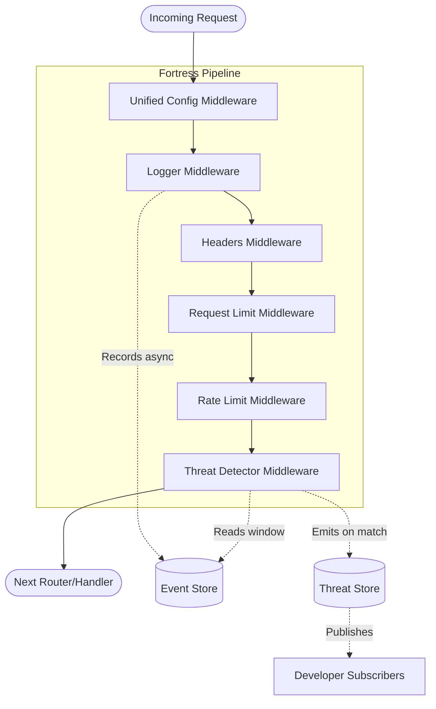

# Internal Architecture

This document details the internal architecture of FortressJS. It is written for engineers, contributors, and technical evaluators who want to understand how FortressJS processes requests with high performance while providing complex behavioral analysis.

---

## High-Level Architecture Diagram

---

## Component Breakdown

### 1. Middleware Pipeline
FortressJS is fundamentally a chain of Express middlewares, ordered securely:
1. **Logger**: Must be first to record the request start time and attach `res.on('finish')` hooks.
2. **Headers**: Applied early so that even if a request is rejected later, security headers (like CSP and HSTS) are still present in the response.
3. **Request Limit**: Inspects `Content-Length`. If the payload is too large, it terminates the request with a `413` *before* the body is parsed or rate limit counters are incremented, saving memory.
4. **Rate Limit**: Tracks IP-based request counts. Terminates with `429` if limits are exceeded.
5. **Threat Detector**: Runs last in the chain, attaching analysis hooks that fire asynchronously when the request completes.

### 2. Event Store
The `EventStore` is an in-memory, rolling temporal database of recent traffic.
- **Mechanism**: Every request logged by the Logger middleware is pushed into the `EventStore`.
- **Pruning**: To prevent memory leaks, the store features an active pruning cycle. It sweeps and removes events older than the defined `retention` window (default 5 minutes).

### 3. Threat Store
The `ThreatStore` is an observable data structure.
- **Mechanism**: When the Threat Detector identifies malicious behavior, it creates a `ThreatEvent` (with a unique `id`, `timestamp`, `ip`, and `severity`).
- **Pub/Sub**: Implements the Observer pattern. Developers can use `threatStore.subscribe()` to reactively pipe critical alerts to external systems (e.g., Datadog, Slack) entirely decoupled from the request cycle.

---

## Architecture Decisions & Rationale

### Why Event-Driven Analysis?
Traditional Web Application Firewalls (WAFs) inspect requests synchronously. This blocks the Node.js event loop, adding latency to every request. 

**Decision**: FortressJS evaluates complex behavioral threats (like brute-forcing or payload abuse) *asynchronously* on the `res.on("finish")` hook.
**Rationale**: By pushing threat analysis to the tail-end of the request lifecycle, the actual API response time is unaffected. We trade a microsecond of background processing for zero-latency impact on the user.

### Why a Sliding Time Window?
**Decision**: The Threat Detector queries the `EventStore` using a sliding window calculation (`Date.now() - windowMs`).
**Rationale**: Static counters reset at fixed intervals (e.g., top of the minute), allowing attackers to burst traffic exactly at the reset boundary. A sliding window guarantees continuous, accurate behavioral measurement.

### Why a Flat Unified Configuration?
**Decision**: We deprecated isolated middleware exports in favor of a single `fortress({...})` object.
**Rationale**: Security works best when configured holistically. By passing a single configuration object, FortressJS can internally orchestrate the optimal execution order, ensure shared state (like the `windowMs`) is synchronized across rate-limiters and threat detectors, and provide a massively simplified Developer Experience (DX).
